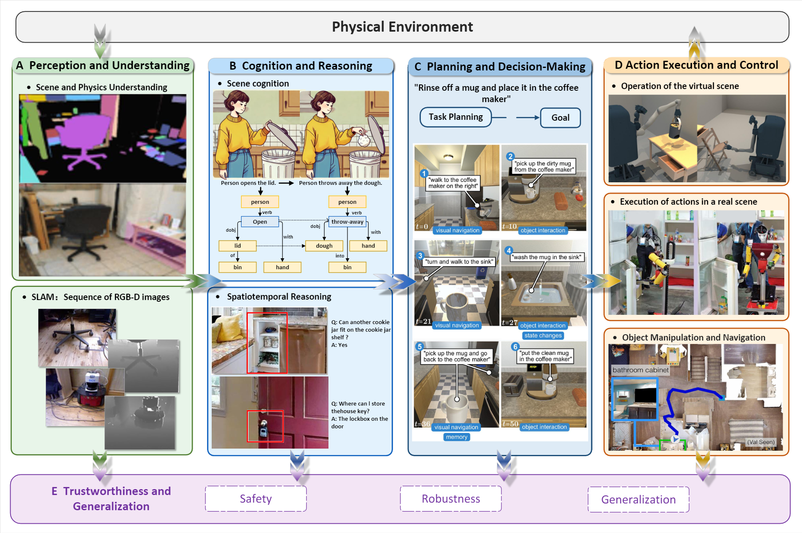

# Embodied-AI-Eval-Survey
A collection of papers and resources related to evaluations on Embodied AI.

# Papers and resources for Embodied AI evaluation

<!-- The papers are organized according to our survey: [A Survey on Evaluation of Embodied AI](embodied ai arxiv上面的链接). -->

NOTE: As we cannot update the arXiv paper in real time, please refer to this repo for the latest updates and the paper may be updated later. We also welcome any pull request or issues to help us make this survey perfect. Your contributions will be acknowledged in acknowledgements.

Please let us know if you find out a mistake or have any suggestions by e-mail: houly25@mails.jlu.edu.cn

(To ensure successful delivery, please also cc lygao25@mails.jlu.edu.cn as a backup.)



## Table of Contents

- [News and Updates](#news-and-updates)
- [What to evaluate](#what-to-evaluate)
  - [Natural language processing](#natural-language-processing)
  - [Robustness, ethics, biases, and trustworthiness](#robustness-ethics-biases-and-trustworthiness)
  - [Social science](#social-science)
  - [Natural science and engineering](#natural-science-and-engineering)
  - [Medical applications](#medical-applications)
  - [Agent applications](#agent-applications)
  - [Other applications](#other-applications)
- [Where to evaluate](#where-to-evaluate)
- [Contributing](#contributing)
- [Citation](#citation)
- [Acknowledgments](#acknowledgements)

---

## 📢 News and updates
- **[2026-01-05]** We created this repository.

## 🗺️ Taxonomy
The papers are organized according to our survey. The taxonomy is shown below:


## 📚 Paper List

### 1. [一级分类：例如 Natural Language Processing]

#### [二级分类：例如 Question Answering]
- **[Paper Title 1]**. [Author 1], [Author 2], et al. **[Conference/Journal]** [Year]. [[Paper]([这里填论文PDF链接])] [[Code]([这里填代码链接])]
- **[Paper Title 2]**. [Author 1], et al. **arXiv** [Year]. [[Paper](链接)]

#### [二级分类：例如 Reasoning]
- **[Paper Title 3]**. ...

### 2. [一级分类：例如 Computer Vision]

#### [二级分类：例如 Image Generation]
- ...

## 🤝 Contributing
Feel free to create a Pull Request or open an Issue to add new related papers.
## 📝 Citation
```bibtex
@article{your_surname202Xtitle,
  title={Your Paper Title},
  author={Your Name and Co-authors},
  journal={arXiv preprint arXiv:XXXX.XXXXX},
  year={202X}
}
