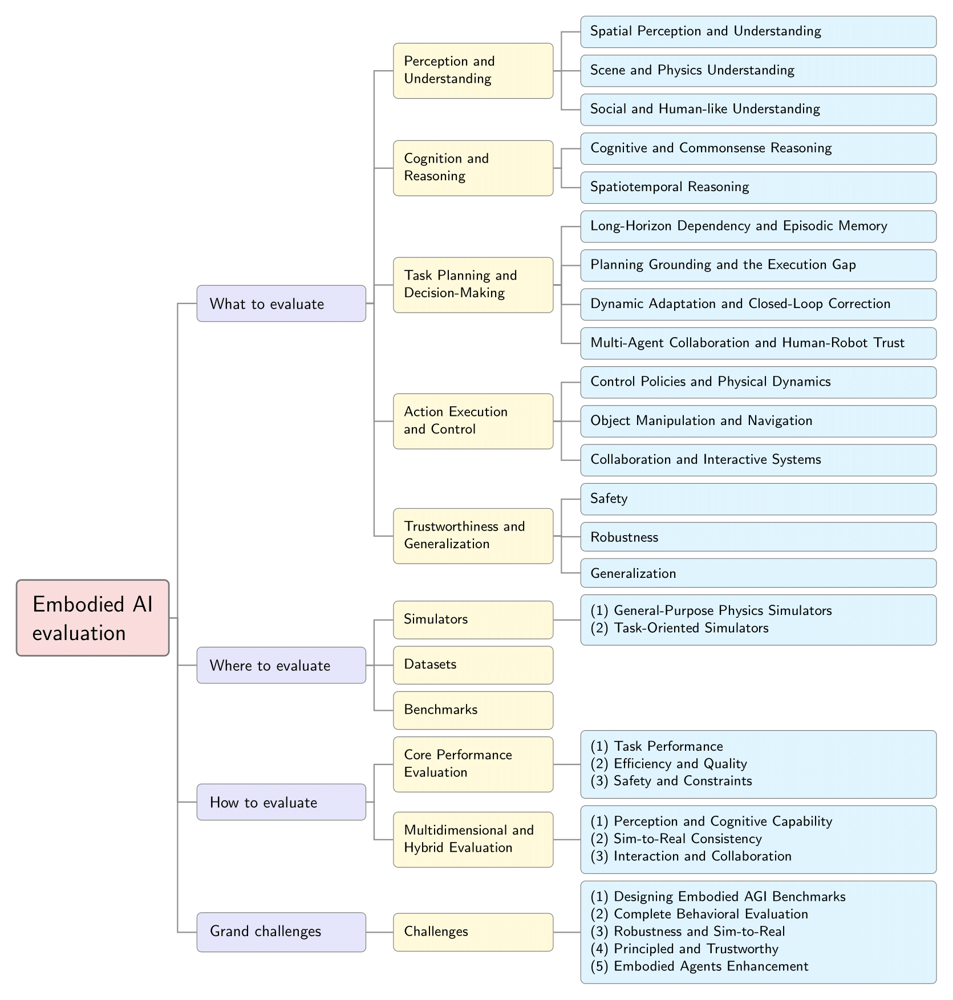

# Embodied-AI-Eval-Survey
A collection of papers and resources related to evaluations on Embodied AI.

# Papers and resources for Embodied AI evaluation

<!-- The papers are organized according to our survey: [A Survey on Evaluation of Embodied AI](embodied ai arxiv上面的链接). -->

NOTE: As we cannot update the arXiv paper in real time, please refer to this repo for the latest updates and the paper may be updated later. We also welcome any pull request or issues to help us make this survey perfect. Your contributions will be acknowledged in acknowledgements.

Please let us know if you find out a mistake or have any suggestions by e-mail: houly25@mails.jlu.edu.cn.

(We recommend copying lygao25@mails.jlu.edu.cn to ensure your message reaches us.)



## Table of Contents

- [News and Updates](#news-and-updates)
- [What to evaluate](#what-to-evaluate)
  - [Perception and Understanding](#perception-and-understanding)
  - [Cognition and Reasoning](#cognition-and-reasoning)
  - [Task Planning and Decision-Making](#task-planning-and-decision-making)
  - [Action Execution and Control](#action-execution-and-control)
  - [Trustworthiness and Generalization](#trustworthiness-and-generalization)
- [Where to evaluate](#where-to-evaluate)
  - [Simulators](#simulators)
  - [Datasets](#datasets)
  - [Benchmarks](#benchmarks)
<!-- - [How to evaluate](#How-to-evaluate)
  - [Core Performance Evaluation](#Core-Performance-Evaluation)
  - [Multidimensional and Hybrid Evaluation](#Multidimensional-and-Hybrid-Evaluation)
- [Contributing](#contributing)
- [Citation](#citation) -->
<!-- - [Acknowledgments](#acknowledgements) -->

---

## 📢 News and updates <a id="news-and-updates"></a>
- **[2026-01-05]** We created this repository.

## 📚 What to evaluation <a id="what-to-evaluate"></a>

### Perception and Understanding <a id="perception-and-understanding"></a>

#### Spatial Perception and Understanding
1. An evaluation of the RGB-D SLAM system. Felix Endres et al. ICRA 2012. [[paper](https://ieeexplore.ieee.org/abstract/document/6225199)]
2. A benchmark for the evaluation of RGB-D SLAM systems. Jürgen Sturm IROS 2012. [[paper](https://ieeexplore.ieee.org/abstract/document/6385773)][[data](https://cvg.cit.tum.de/data/datasets/rgbd-dataset)]
3. Comprehensive performance evaluation between visual slam and lidar slam for mobile robots: Theories and experiments. Yu-Lin Zhao et al. Applied Sciences 2024. [[paper](https://www.mdpi.com/2076-3417/14/9/3945)]
4. Performance evaluation of 2D LiDAR SLAM algorithms in simulated orchard environments. Qiujie Li et al. Computers and Electronics in Agriculture 2024. [[paper](https://www.sciencedirect.com/science/article/pii/S0168169924003855)]
5. LiDAR-based 3D SLAM for autonomous navigation in stacked cage farming houses: An evaluation. Jiacheng Jiang et al. Computers and Electronics in Agriculture 2025. [[paper](https://www.sciencedirect.com/science/article/pii/S0168169924012766)]
6. A Review of Simultaneous Localization and Mapping for the Robotic-Based Nondestructive Evaluation of Infrastructures. Ali Ghadimzadeh Alamdari et al. Sensors 2025. [[paper](https://www.mdpi.com/1424-8220/25/3/712)][[data](https://github.com/arvinebr/SLAM_review)]
7. How challenging is a challenge? cems: a challenge evaluation module for slam visual perception. Xuhui Zhao et al. JINT 2024. [[paper](https://link.springer.com/article/10.1007/s10846-024-02077-4)]
8. Embodiedscan: A holistic multi-modal 3d perception suite towards embodied ai. Tai Wang et al. CVPR 2024. [[paper](https://openaccess.thecvf.com/content/CVPR2024/html/Wang_EmbodiedScan_A_Holistic_Multi-Modal_3D_Perception_Suite_Towards_Embodied_AI_CVPR_2024_paper.html)]
9. Embspatial-bench: Benchmarking spatial understanding for embodied tasks with large vision-language models. Mengfei Du et al. ACL 2024. [[paper](https://aclanthology.org/2024.acl-short.33/)][[data](https://github.com/mengfeidu/EmbSpatial-Bench)]
10. Spatial reasoning with vision-language models in ego-centric multi-view scenes. Mohsen Gholami et al. arXiv 2025. [[paper](https://arxiv.org/abs/2509.06266)]
11. Towards Autonomous UAV Visual Object Search in City Space: Benchmark and Agentic Methodology. Yatai Ji et al. arXiv 2025. [[paper](https://arxiv.org/abs/2505.08765)]
12. Why do mllms struggle with spatial understanding? a systematic analysis from data to architecture. Wanyue Zhang et al. arXiv 2025. [[paper](https://arxiv.org/abs/2509.02359)][[data](https://huggingface.co/datasets/WanyueZhang/MulSeT)][[code](https://github.com/WanyueZhang-ai/spatial-understanding)]
13. Seeing from another perspective: Evaluating multi-view understanding in mllms. Chun-Hsiao Yeh et al. arXiv 2025. [[paper](https://arxiv.org/abs/2504.15280)][[benchmark](https://danielchyeh.github.io/All-Angles-Bench/)]
14. Beyond the Visible: Benchmarking Occlusion Perception in Multimodal Large Language Models. Zhaochen Liu et al. arXiv 2025. [[paper](https://arxiv.org/abs/2508.04059)]
15. Towards Omnidirectional Reasoning with 360-R1: A Dataset, Benchmark, and GRPO-based Method. Xinshen Zhang et al. arXiv 2025. [[paper](https://arxiv.org/abs/2505.14197)]
16. CaptionQA: Is Your Caption as Useful as the Image Itself?. Shijia Yang et al. arXiv 2025. [[paper](https://arxiv.org/abs/2511.21025)][[code](https://github.com/bronyayang/CaptionQA)]
17. ViewSpatial-Bench: Evaluating Multi-perspective Spatial Localization in Vision-Language Models. Dingming Li et al. arXiv 2025. [[paper](https://arxiv.org/abs/2505.21500)]
18. InternSpatial: A Comprehensive Dataset for Spatial Reasoning in Vision-Language Models. Nianchen Deng et al. arXiv 2025. [[paper](https://arxiv.org/abs/2506.18385)]

#### Scene and Physics Understanding
1. Llm meets scene graph: Can large language models understand and generate scene graphs? a benchmark and empirical study. Dongil Yang et al. ACL 2025. [[paper](https://aclanthology.org/2025.acl-long.1036/)][[benchmark](https://tsg-bench.netlify.app/)][[code](https://github.com/docworlds/tsg-bench)]
2. Embodiedscan: A holistic multi-modal 3d perception suite towards embodied ai. Tai Wang et al. CVPR 2024. [[paper](https://openaccess.thecvf.com/content/CVPR2024/html/Wang_EmbodiedScan_A_Holistic_Multi-Modal_3D_Perception_Suite_Towards_Embodied_AI_CVPR_2024_paper.html)]
3. ObjVariantEnsemble: Advancing Point Cloud LLM Evaluation in Challenging Scenes with Subtly Distinguished Objects. Qihang Cao et al. Proceedings of the AAAI Conference on Artificial Intelligence 2025. [[paper](https://ojs.aaai.org/index.php/AAAI/article/view/32190)][[projectpage](https://ove-benchmark.github.io/OVE/)]
4. CORE-3D: Context-aware Open-vocabulary Retrieval by Embeddings in 3D. Mohamad Amin Mirzaei et al. arXiv 2025. [[paper](https://arxiv.org/abs/2509.24528)]
5. Physbench: Benchmarking and enhancing vision-language models for physical world understanding. Wei Chow et al. ICLR 2025. [[paper](https://arxiv.org/abs/2501.16411)][[projectpage](https://physbench.github.io/)]
6. Text-Scene: A Scene-to-Language Parsing Framework for 3D Scene Understanding. Haoyuan Li et al. arXiv 2025. [[paper](https://arxiv.org/abs/2509.16721)]
7. Wow: Towards a world omniscient world model through embodied interaction. Xiaowei Chi et al. arXiv 2025. [[paper](https://arxiv.org/abs/2509.22642)]
8. PhysToolBench: Benchmarking Physical Tool Understanding for MLLMs. Zixin Zhang et al. arXiv 2025. [[paper](https://arxiv.org/abs/2510.09507)][[projectpage](https://github.com/EnVision-Research/PhysToolBench)]


#### Social and Human-like Understanding
1. Activitynet: A large-scale video benchmark for human activity understanding. Fabian Caba Heilbron et al. CVPR 2015. [[paper](https://openaccess.thecvf.com/content_cvpr_2015/html/Heilbron_ActivityNet_A_Large-Scale_2015_CVPR_paper.html)][[projectpage](http://activity-net.org/)]
2. ACT-thor: A controlled benchmark for embodied action understanding in simulated environments. Michael Hanna et al. COLING 2022. [[paper](https://aclanthology.org/2022.coling-1.495/)][[data](https://github.com/hannamw/ACT-Thor)]
3. HIS-GPT: Towards 3D Human-In-Scene Multimodal Understanding. Jiahe Zhao et al. ICCV 2025. [[paper](https://arxiv.org/abs/2503.12955)][[benchmark](https://github.com/ZJHTerry18/HumanInScene)]
4. Can Vision Language Models Understand Mimed Actions?. Hyundong Justin Cho et al. Findings of ACL 2025. [[paper](https://aclanthology.org/2025.findings-acl.1372/)][[projectpage](https://justin-cho.com/mime)]
5. SoMi-ToM: Evaluating Multi-Perspective Theory of Mind in Embodied Social Interactions. Xianzhe Fan et al. arXiv 2025. [[paper](https://arxiv.org/abs/2506.23046)][[benchmark](https://github.com/XianzheFan/SoMi-ToM)][[data](https://huggingface.co/datasets/SoMi-ToM/SoMi-ToM)]
6. MEMO-Bench: A Multiple Benchmark for Text-to-Image and Multimodal Large Language Models on Human Emotion Analysis. Yingjie Zhou et al. arXiv 2024. [[paper](https://arxiv.org/abs/2411.11235)]
7. EmpathyAgent: Can Embodied Agents Conduct Empathetic Actions?. Xinyan Chen et al. arXiv 2025. [[paper](https://arxiv.org/abs/2503.16545)][[code&data](https://github.com/xinyan-cxy/EmpathyAgent)]

### Cognition and Reasoning <a id="cognition-and-reasoning"></a>

#### Cognitive and Commonsense Reasoning
1. Urbanvideo-bench: Benchmarking vision-language models on embodied intelligence with video data in urban spaces. Baining Zhao et al. arXiv 2025. [[paper](https://arxiv.org/abs/2503.06157)][[projectpage](https://embodiedcity.github.io/UrbanVideo-Bench/)][[data](https://huggingface.co/datasets/EmbodiedCity/UrbanVideo-Bench)][[code](https://github.com/EmbodiedCity/UrbanVideo-Bench.code)]
2. Rynnec: Bringing mllms into embodied world. Ronghao Dang et al. arXiv 2025. [[paper](https://arxiv.org/abs/2508.14160)][[projectpage](https://github.com/alibaba-damo-academy/RynnEC)]
3. TinyLVLM-eHub: Towards comprehensive and efficient evaluation for large vision-language models. Wenqi Shao et al. TBD 2025. [[paper](https://ieeexplore.ieee.org/abstract/document/10858438)][[projectpage](https://github.com/OpenGVLab/Multi-Modality-Arena)]
4. Perceive, ground, reason, and act: A benchmark for general-purpose visual representation. Jiangyong Huang et al. arXiv 2022. [[paper](https://arxiv.org/abs/2211.15402)]
5. Text-Scene: A Scene-to-Language Parsing Framework for 3D Scene Understanding. Haoyuan Li et al. arXiv 2025. [[paper](https://arxiv.org/abs/2509.16721)]
6. OmniEAR: Benchmarking Agent Reasoning in Embodied Tasks. Zixuan Wang et al. arXiv 2025. [[paper](https://arxiv.org/abs/2508.05614)][[GitHub](https://github.com/ZJU-REAL/OmniEmbodied)][[projectpage](https://zju-real.github.io/OmniEmbodied)]
7. Openeqa: Embodied question answering in the era of foundation models. Arjun Majumdar et al. CVPR 2024. [[paper](https://openaccess.thecvf.com/content/CVPR2024/html/Majumdar_OpenEQA_Embodied_Question_Answering_in_the_Era_of_Foundation_Models_CVPR_2024_paper.html)][[projectpage](https://open-eqa.github.io/)]
8. VIVA+: Human-Centered Situational Decision-Making. Zhe Hu et al. EMNLP Findings 2025. [[paper](https://arxiv.org/abs/2509.23698)][[projectpage](https://derekhu.com/project_page/viva_plus_website/)]
9. CognitiveDrone: A VLA model and evaluation benchmark for real-time cognitive task solving and reasoning in UAVs. Artem Lykov et al. arXiv 2025. [[paper](https://arxiv.org/abs/2503.01378)][[projectpage](https://cognitivedrone.github.io/)]
10. Point-It-Out: Benchmarking Embodied Reasoning for Vision Language Models in Multi-Stage Visual Grounding. Haotian Xue et al. arXiv 2025. [[paper](https://arxiv.org/abs/2509.25794)][[projectpage](https://research.nvidia.com/labs/dir/pio/)][[GitHub](https://github.com/xavihart/PIO)][[benchmark](https://huggingface.co/pio-benchmark/PIO)]
11. Physbench: Benchmarking and enhancing vision-language models for physical world understanding. Wei Chow et al. ICLR 2025. [[paper](https://arxiv.org/abs/2501.16411)][[projectpage](https://physbench.github.io/)]
12. SITE: towards Spatial Intelligence Thorough Evaluation. Wenqi Wang et al. ICCV 2025. [[paper](https://arxiv.org/abs/2505.05456)][[projectpage](https://wenqi-wang20.github.io/SITE-Bench.github.io/)]
13. ManipBench: Benchmarking vision-language models for low-level robot manipulation. Enyu Zhao et al. CoRL 2025. [[paper](https://arxiv.org/abs/2505.09698)][[projectpage](https://manipbench.github.io/)]
14. WorldLens: Full-Spectrum Evaluations of Driving World Models in Real World. Ao Liang et al. arXiv 2025. [[paper](https://arxiv.org/abs/2512.10958)][[projectpage](https://worldbench.github.io/worldlens)][[GitHub](https://github.com/worldbench/WorldLens)][[Leaderboard](https://huggingface.co/spaces/worldbench/WorldLens)][[data](https://huggingface.co/worldbench/datasets)]
15. From Pixels to Feelings: Aligning MLLMs with Human Cognitive Perception of Images. Yiming Chen et al. arXiv 2025. [[paper](https://arxiv.org/abs/2511.22805)][[projectpage](https://follen-cry.github.io/MLLM-Cognition-project-page/)]
16. Robocskbench: Benchmarking Embodied Commonsense Capabilities of Large Language Models. Jan-Philipp Töberg UR 2025. [[paper](https://ieeexplore.ieee.org/abstract/document/11078036)][[benchmark](https://github.com/ag-sc/Robo-CSK-Benchmark)]
17. Evaluating Multimodal Large Language Models with Daily Composite Tasks in Home Environments. Zhenliang Zhang et al. arXiv 2025. [[paper](https://arxiv.org/abs/2509.17425)]
18. Cello: Causal evaluation of large vision-language models. Meiqi Chen et al. arXiv 2024. [[paper](https://arxiv.org/abs/2406.19131)][[projectpage](https://github.com/OpenCausaLab/CELLO)]
19. Et-plan-bench: Embodied task-level planning benchmark towards spatial-temporal cognition with foundation models. Lingfeng Zhang et al. arXiv 2024. [[paper](https://arxiv.org/abs/2410.14682)]
20. Urbanvideo-bench: Benchmarking vision-language models on embodied intelligence with video data in urban spaces. Baining Zhao et al. arXiv 2025. [[paper](https://arxiv.org/abs/2503.06157)][[projectpage](https://embodiedcity.github.io/UrbanVideo-Bench/)][[data](https://huggingface.co/datasets/EmbodiedCity/UrbanVideo-Bench)][[code](https://github.com/EmbodiedCity/UrbanVideo-Bench.code)]
21. Embodiedbench: Comprehensive benchmarking multi-modal large language models for vision-driven embodied agents. Rui Yang et al. ICML 2025. [[paper](https://arxiv.org/abs/2502.09560)][[projectpage](https://embodiedbench.github.io/)]
22. StarBench: A Turn-Based RPG Benchmark for Agentic Multimodal Decision-Making and Information Seeking. Haoran Zhang et al. arXiv 2025. [[paper](https://arxiv.org/abs/2510.18483)]

#### Spatiotemporal Reasoning
1. Open3dvqa: A benchmark for comprehensive spatial reasoning with multimodal large language model in open space. Weichen Zhang et al. arXiv 2025. [[paper](https://arxiv.org/abs/2503.11094)][[benchmark](https://github.com/EmbodiedCity/Open3D-VQA.code)]
2. Are Multimodal Large Language Models Ready for Omnidirectional Spatial Reasoning?. Zihao Dongfang et al. arXiv 2025. [[paper](https://arxiv.org/abs/2505.11907)][[benchmark&code](https://huggingface.co/datasets/UUUserna/OSR-Bench)]
3. Evaluation of Vision-LLMs in Surveillance Video. Pascal Benschop et al. NeurIPS 2025. [[paper](https://arxiv.org/abs/2510.23190)][[evaluate](https://github.com/pascalbenschopTU/VLLM_AnomalyRecognition)]
4. Rynnec: Bringing mllms into embodied world. Ronghao Dang et al. arXiv 2025. [[paper](https://arxiv.org/abs/2508.14160)][[projectpage](https://github.com/alibaba-damo-academy/RynnEC)]
5. MonoSR: Open-Vocabulary Spatial Reasoning from Monocular Images. Qirui Wang et al. arXiv 2025. [[paper](https://arxiv.org/abs/2511.19119)][[projectpage](https://7rwang.github.io/MonoSR/)][[code](https://github.com/Zhantao-Gong/FSU-QA)][[data](https://huggingface.co/datasets/xxxgosh/MonoSR)]
6. Seeing Across Views: Benchmarking Spatial Reasoning of Vision-Language Models in Robotic Scenes. Zhiyuan Feng et al. arXiv 2025. [[paper](https://arxiv.org/abs/2510.19400)][[benchmark](https://github.com/microsoft/MV-RoboBench)]
7. SITE: towards Spatial Intelligence Thorough Evaluation. Wenqi Wang et al. ICCV 2025. [[paper](https://arxiv.org/abs/2505.05456)][[projectpage](https://wenqi-wang20.github.io/SITE-Bench.github.io/)]
8. Spatial reasoning with vision-language models in ego-centric multi-view scenes. Mohsen Gholami et al. arXiv 2025. [[paper](https://arxiv.org/abs/2509.06266)][[projectpage](https://vbdi.github.io/Ego3D-Bench-webpage/)][[code](https://github.com/vbdi/Ego3D-Bench)][[data](https://huggingface.co/datasets/vbdai/Ego3D-Bench)]
9. Towards Cross-View Point Correspondence in Vision-Language Models. Yipu Wang et al. arXiv 2025. [[paper](https://arxiv.org/abs/2512.04686)][[code](https://github.com/WangYipu2002/CrossPoint)]
10. 3DLLM-Mem: Long-Term Spatial-Temporal Memory for Embodied 3D Large Language Model. Wenbo Hu et al. arXiv 2025. [[paper](https://arxiv.org/abs/2505.22657)][[projectpage](https://3dllm-mem.github.io/)]
11. Ost-bench: Evaluating the capabilities of mllms in online spatio-temporal scene understanding. JingLi Lin et al. arXiv 2025. [[paper](https://arxiv.org/abs/2507.07984)][[projectpage](https://rbler1234.github.io/OSTBench.github.io/)]
12. Out of Sight, Not Out of Context? Egocentric Spatial Reasoning in VLMs Across Disjoint Frames. Sahithya Ravi et al. EMNLP 2025. [[paper](https://aclanthology.org/2025.emnlp-main.816/)][[code&data](https://github.com/sahithyaravi/DISJOINT-3DQA)]
13. EOC-Bench: Can MLLMs Identify, Recall, and Forecast Objects in an Egocentric World?. Yuqian Yuan et al. arXiv 2025. [[paper](https://arxiv.org/abs/2506.05287)][[projectpage](https://circleradon.github.io/EOCBench/)][[code](https://github.com/alibaba-damo-academy/EOCBench)][[benchmark](https://huggingface.co/datasets/CircleRadon/EOC-Bench)]
14. Embrace-3k: Embodied reasoning and action in complex environments. Mingxian Lin et al. arXiv 2025. [[paper](https://arxiv.org/abs/2507.10548)][[projectpage](https://mxllc.github.io/EmbRACE-3K/)]
15. Robocas: A benchmark for robotic manipulation in complex object arrangement scenarios. Liming Zheng et al. arXiv 2024. [[paper](https://arxiv.org/abs/2407.06951)][[projectpage](https://github.com/notFoundThisPerson/RoboCAS-v0)]
16. RoboRefer: Towards Spatial Referring with Reasoning in Vision-Language Models for Robotics. Enshen Zhou et al. NeurIPS 2025. [[paper](https://arxiv.org/abs/2506.04308)][[projectpage](https://zhoues.github.io/RoboRefer/)]
17. SVAG-Bench: A Large-Scale Benchmark for Multi-Instance Spatio-temporal Video Action Grounding. Tanveer Hannan et al. arXiv 2025. [[paper](https://arxiv.org/abs/2510.13016)][[workshop](https://motchallenge.net/workshops/bmtt2025/)][[Codabench platform](https://www.codabench.org/competitions/9743/)]
18. AViLA: Asynchronous Vision-Language Agent for Streaming Multimodal Data Interaction. Gengyuan Zhang et al. arXiv 2025. [[paper](https://arxiv.org/abs/2506.18472)]
19. Eyes wide open: Ego proactive video-llm for streaming video. Yulin Zhang et al. NeurIPS 2025. [[paper](https://arxiv.org/abs/2510.14560)][[projectpage](https://zhangyl4.github.io/publications/eyes-wide-open/)]
20. RoboSeek: You Need to Interact with Your Objects. Yibo Peng et al. arXiv 2025. [[paper](https://arxiv.org/abs/2509.17783)][[projectpage](https://russderrick.github.io/Roboseek/)]

### Task Planning and Decision-Making <a id="task-planning-and-decision-making"></a>
#### Long-Horizon Dependency and Episodic Memory
1. Mini-behavior: A procedurally generated benchmark for long-horizon decision-making in embodied ai. Emily Jin et al. arXiv 2023. [[paper](https://arxiv.org/abs/2310.01824)][[code](https://github.com/StanfordVL/mini_behavior)]
2. Behavior: Benchmark for everyday household activities in virtual, interactive, and ecological environments. Sanjana Srivastava et al. Conference on robot learning 2022. [[paper](https://proceedings.mlr.press/v164/srivastava22a.html)][[projectpage](https://behavior.stanford.edu/)]
3. Behavior-1k: A human-centered, embodied ai benchmark with 1,000 everyday activities and realistic simulation. Chengshu Li et al. arXiv 2024. [[paper](https://arxiv.org/abs/2403.09227)][[projectpage](https://behavior.stanford.edu/)]
4. ManiTaskGen: A Comprehensive Task Generator for Benchmarking and Improving Vision-Language Agents on Embodied Decision-Making. Liu Dai et al. arXiv 2025. [[paper](https://arxiv.org/abs/2505.20726)][[projectpage](https://manitaskgen.github.io/)][[code](https://github.com/bbbbbMatrix/ManiTaskGen)]
5. Cookbench: A long-horizon embodied planning benchmark for complex cooking scenarios. Muzhen Cai et al. arXiv 2025. [[paper](https://arxiv.org/abs/2508.03232)]
6. Vlabench: A large-scale benchmark for language-conditioned robotics manipulation with long-horizon reasoning tasks. Shiduo Zhang et al. ICCV 2025. [[paper](https://openaccess.thecvf.com/content/ICCV2025/html/Zhang_VLABench_A_Large-Scale_Benchmark_for_Language-Conditioned_Robotics_Manipulation_with_Long-Horizon_ICCV_2025_paper.html)][[projectpage](https://vlabench.github.io/)]
7. Actplan-1k: Benchmarking the procedural planning ability of visual language models in household activities. Ying Su et al. EMNLP 2024. [[paper](https://aclanthology.org/2024.emnlp-main.833/)]
8. Egoplan-bench: Benchmarking multimodal large language models for human-level planning. Yi Chen et al. arXiv 2023. [[paper](https://arxiv.org/abs/2312.06722)][[projectpage](https://chenyi99.github.io/ego_plan/)][[GitHub](https://github.com/ChenYi99/EgoPlan)]
9. Videgothink: Assessing egocentric video understanding capabilities for embodied ai. Sijie Cheng et al. arXiv 2024. [[paper](https://arxiv.org/abs/2410.11623)]
10. Bear: Benchmarking and enhancing multimodal language models for atomic embodied capabilities. Yu Qi et al. arXiv 2025. [[paper](https://arxiv.org/abs/2510.08759)][[projectpage](https://bear-official66.github.io/)]
11. Lvbench: An extreme long video understanding benchmark. Weihan Wang et al. ICCV 2025. [[paper](https://arxiv.org/abs/2406.08035)]
12. X-lebench: A benchmark for extremely long egocentric video understanding. Wenqi Zhou et al. arXiv 2025. [[paper](https://arxiv.org/abs/2501.06835)][[code](https://github.com/X-Intelligence-Labs/X-LeBench)]
13. FindingDory: A Benchmark to Evaluate Memory in Embodied Agents. Karmesh Yadav et al. arXiv 2025. [[paper](https://arxiv.org/abs/2506.15635)][[projectpage](https://findingdory-benchmark.github.io/)]
14. GTR-Bench: Evaluating Geo-Temporal Reasoning in Vision-Language Models. Qinghongbing Xie et al. arXiv 2025. [[paper](https://arxiv.org/abs/2510.07791)][[code&benchmark](https://github.com/X-Luffy/GTR-Bench)]
15. Alfred: A benchmark for interpreting grounded instructions for everyday tasks. Mohit Shridhar et al. CVPR 2020. [[paper](https://arxiv.org/abs/1912.01734)][[projectpage](https://askforalfred.com/)]
16. Calvin: A benchmark for language-conditioned policy learning for long-horizon robot manipulation tasks. Oier Mees et al. IEEE Robotics and Automation Letters 2022. [[paper](https://arxiv.org/abs/2112.03227)][[projectpage](http://calvin.cs.uni-freiburg.de/)]

#### Planning Grounding and the Execution Gap

1. Calvin: A benchmark for language-conditioned policy learning for long-horizon robot manipulation tasks. Oier Mees et al. IEEE Robotics and Automation Letters 2022.[[paper](https://arxiv.org/abs/2112.03227)][[projectpage](http://calvin.cs.uni-freiburg.de/)]
2. Mind and motion aligned: a joint evaluation ISAACSIM benchmark for task planning and low-level policies in mobile manipulation. Nikita Kachaev et al. arXiv 2025. [[paper](https://arxiv.org/abs/2508.15663)]
3. The threedworld transport challenge: A visually guided task-and-motion planning benchmark towards physically realistic embodied ai. Chuang Gan et al. 2022 International conference on robotics and automation (ICRA) 2022. [[paper](LINK)]
4. Arnold: A benchmark for language-grounded task learning with continuous states in realistic 3d scenes. Ran Gong et al. ICCV 2023. [[paper](LINK)]
5. EMIF-Bench: A Benchmark for Embodied Multi-Modal Instruction Following. Qin Yixin et al. 2024 21st International Computer Conference on Wavelet Active Media Technology and Information Processing (ICCWAMTIP) 2024. [[paper](LINK)]
6. Pca-bench: Evaluating multimodal large language models in perception-cognition-action chain. Liang Chen et al. arXiv 2024. [[paper](LINK)]
7. Mmt-bench: A comprehensive multimodal benchmark for evaluating large vision-language models towards multitask agi. Kaining Ying et al. arXiv 2024. [[paper](LINK)]
8. Towards end-to-end embodied decision making via multi-modal large language model: Explorations with gpt4-vision and beyond. Liang Chen et al. arXiv 2023. [[paper](LINK)]
9. A control-centric benchmark for video prediction. Stephen Tian et al. arXiv 2023. [[paper](LINK)]
10. Robobench: A Comprehensive Evaluation Benchmark for Multimodal Large Language Models as Embodied Brain. Yulin Luo et al. arXiv 2025. [[paper](LINK)]
11. Mfe-etp: A comprehensive evaluation benchmark for multi-modal foundation models on embodied task planning. Min Zhang et al. arXiv 2024. [[paper](LINK)]
12. Mpcc: A novel benchmark for multimodal planning with complex constraints in multimodal large language models. Yiyan Ji et al. Proceedings of the 33rd ACM International Conference on Multimedia 2025. [[paper](LINK)]
13. PhyBlock: A Progressive Benchmark for Physical Understanding and Planning via 3D Block Assembly. Liang Ma et al. arXiv 2025. [[paper](LINK)]
14. MAP-THOR: Benchmarking Long-Horizon Multi-Agent Planning Frameworks in Partially Observable Environments. Siddharth Nayak et al. Venue 202X. [[paper](LINK)]
15. RoVer: Robot Reward Model as Test-Time Verifier for Vision-Language-Action Model. Mingtong Dai et al. arXiv 2025. [[paper](LINK)]

#### Dynamic Adaptation and Closed-Loop Correction
1. Mind and motion aligned: a joint evaluation ISAACSIM benchmark for task planning and low-level policies in mobile manipulation. Nikita Kachaev et al. arXiv 2025. [[paper](LINK)]
2. The threedworld transport challenge: A visually guided task-and-motion planning benchmark towards physically realistic embodied ai. Chuang Gan et al. 2022 International conference on robotics and automation (ICRA) 2022. [[paper](LINK)]
3. Muep: A multimodal benchmark for embodied planning with foundation models [c]. Kanxue Li et al. Intemational Joint Conferences on Artificial Intelligence. IJCAI 2024. [[paper](LINK)]
4. Lota-bench: Benchmarking language-oriented task planners for embodied agents. Jae-Woo Choi et al. arXiv 2024. [[paper](LINK)]
5. GTR-Bench: Evaluating Geo-Temporal Reasoning in Vision-Language Models. Qinghongbing Xie et al. arXiv 2025. [[paper](LINK)]
6. Towards autonomous micromobility through scalable urban simulation. Wayne Wu et al. CVPR 2025. [[paper](LINK)]
7. Beyond the destination: A novel benchmark for exploration-aware embodied question answering. Kaixuan Jiang et al. arXiv 2025. [[paper](LINK)]
8. ViRectify:A Challenging Benchmark for Video Reasoning Correction with Multimodal Large Language Models. Xusen Hei et al. arXiv 2025. [[paper](LINK)]
9. EMMOE: A Comprehensive Benchmark for Embodied Mobile Manipulation in Open Environments. Dongping Li et al. arXiv 2025. [[paper](LINK)]
10. Towards Proprioception-Aware Embodied Planning for Dual-Arm Humanoid Robots. Boyu Li et al. arXiv 2025. [[paper](LINK)]
11. FOSSIL: Harnessing Feedback on Suboptimal Samples for Data-Efficient Generalisation with Imitation Learning for Embodied Vision-and-Language Tasks. Sabrina McCallum et al. ACL 2025. [[paper](LINK)]
12. ManiTaskGen: A Comprehensive Task Generator for Benchmarking and Improving Vision-Language Agents on Embodied Decision-Making. Liu Dai et al. arXiv 2025. [[paper](LINK)]
13. Embodied Perception for Test-time Grasping Detection Adaptation with Knowledge Infusion. Jin Liu et al. arXiv 2025. [[paper](LINK)]
14. Mastering robot manipulation with multimodal prompts through pretraining and multi-task fine-tuning. Jiachen Li et al. arXiv 2023. [[paper](LINK)]
#### Human-in-the-Loop Planning and Intent Alignment
1. Long-horizon planning for multi-agent robots in partially observable environments. Sid Nayak et al. NeurIPS 2024. [[paper](LINK)]
2. CleanUpBench: Embodied Sweeping and Grasping Benchmark. Wenbo Li et al. arXiv 2025. [[paper](LINK)]
3. Cookbench: A long-horizon embodied planning benchmark for complex cooking scenarios. Muzhen Cai et al. arXiv 2025. [[paper](LINK)]
4. PersONAL: Towards a Comprehensive Benchmark for Personalized Embodied Agents. Filippo Ziliotto et al. arXiv 2025. [[paper](LINK)]
5. Dialfred: Dialogue-enabled agents for embodied instruction following. Xiaofeng Gao et al. IEEE Robotics and Automation Letters 2022. [[paper](LINK)]
6. Towards autonomous micromobility through scalable urban simulation. Wayne Wu et al. CVPR 2025. [[paper](LINK)]

### Action Execution and Control <a id="action-execution-and-control"></a>
#### Control Policies and Physical Dynamics
1. Deepmind control suite. Yuval Tassa et al. arXiv 2018. [[paper](LINK)]
2. Evaluating real-world robot manipulation policies in simulation. Xuanlin Li et al. arXiv 2024. [[paper](LINK)]
3. Surreal: Open-source reinforcement learning framework and robot manipulation benchmark. Linxi Fan et al. Conference on robot learning 2018. [[paper](LINK)]
4. TeleOpBench: A Simulator-Centric Benchmark for Dual-Arm Dexterous Teleoperation. Hangyu Li et al. arXiv 2025. [[paper](LINK)]
5. Interactive Gibson Benchmark (iGibson 0.5): A Benchmark for Interactive Navigation in Cluttered Environments. Fei Xia et al. Venue 202X. [[paper](LINK)]
6. Mind and motion aligned: a joint evaluation ISAACSIM benchmark for task planning and low-level policies in mobile manipulation. Nikita Kachaev et al. arXiv 2025. [[paper](LINK)]
7. Maniskill-hab: A benchmark for low-level manipulation in home rearrangement tasks. Arth Shukla et al. arXiv 2024. [[paper](LINK)]
8. Rethinking the embodied gap in vision-and-language navigation: A holistic study of physical and visual disparities. Liuyi Wang et al. ICCV 2025. [[paper](LINK)]
9. Benchmarking vision, language, \& action models on robotic learning tasks. Pranav Guruprasad et al. arXiv 2024. [[paper](LINK)]
10. Embodied Perception for Test-time Grasping Detection Adaptation with Knowledge Infusion. Jin Liu et al. arXiv 2025. [[paper](LINK)]
11. EnvTrace: Simulation-Based Semantic Evaluation of LLM Code via Execution Trace Alignment--Demonstrated at Synchrotron Beamlines. Noah van der Vleuten et al. arXiv 2025. [[paper](LINK)]

#### Object Manipulation and Navigation
1. Rlbench: The robot learning benchmark \& learning environment. Stephen James et al. IEEE Robotics and Automation Letters 2020. [[paper](LINK)]
2. Bigym: A demo-driven mobile bi-manual manipulation benchmark. Nikita Chernyadev et al. arXiv 2024. [[paper](LINK)]
3. Robobench: A Comprehensive Evaluation Benchmark for Multimodal Large Language Models as Embodied Brain. Yulin Luo et al. arXiv 2025. [[paper](LINK)]
4. Open6DOR: Benchmarking open-instruction 6-DoF object rearrangement and a VLM-based approach. Yufei Ding et al. 2024 IEEE/RSJ International Conference on Intelligent Robots and Systems (IROS) 2024. [[paper](LINK)]
5. Embodiedbench: Comprehensive benchmarking multi-modal large language models for vision-driven embodied agents. Rui Yang et al. arXiv 2025. [[paper](LINK)]
6. Graspnet-1billion: A large-scale benchmark for general object grasping. Hao-Shu Fang et al. CVPR 2020. [[paper](LINK)]
7. Alfworld: Aligning text and embodied environments for interactive learning. Mohit Shridhar et al. arXiv 2020. [[paper](LINK)]
8. Lohoravens: A long-horizon language-conditioned benchmark for robotic tabletop manipulation. Shengqiang Zhang et al. arXiv 2023. [[paper](LINK)]
9. Visual room rearrangement. Luca Weihs et al. CVPR 2021. [[paper](LINK)]
10. Objectnav revisited: On evaluation of embodied agents navigating to objects. Dhruv Batra et al. arXiv 2020. [[paper](LINK)]
11. MoMa-Kitchen: A 100K+ Benchmark for Affordance-Grounded Last-Mile Navigation in Mobile Manipulation. Pingrui Zhang et al. arXiv 2025. [[paper](LINK)]
12. On evaluation of embodied navigation agents. Peter Anderson et al. arXiv 2018. [[paper](LINK)]
13. Hm3d-ovon: A dataset and benchmark for open-vocabulary object goal navigation. Naoki Yokoyama et al. 2024 IEEE/RSJ International Conference on Intelligent Robots and Systems (IROS) 2024. [[paper](LINK)]
14. SimWorld-Robotics: Synthesizing Photorealistic and Dynamic Urban Environments for Multimodal Robot Navigation and Collaboration. Yan Zhuang et al. arXiv 2025. [[paper](LINK)]
15. Uav-on: A benchmark for open-world object goal navigation with aerial agents. Jianqiang Xiao et al. Proceedings of the 33rd ACM International Conference on Multimedia 2025. [[paper](LINK)]
16. Goat-bench: A benchmark for multi-modal lifelong navigation. Mukul Khanna et al. CVPR 2024. [[paper](LINK)]

#### Collaboration and Interactive Systems
1. Improving Cooperation in Collaborative Embodied AI. Hima Jacob Leven Suprabha et al. arXiv 2025. [[paper](LINK)]
2. Benchmark real-time adaptation and communication capabilities of embodied agent in collaborative scenarios. Shipeng Liu et al. arXiv 2024. [[paper](LINK)]
3. Robofactory: Exploring embodied agent collaboration with compositional constraints. Yiran Qin et al. arXiv 2025. [[paper](LINK)]
4. Navcomposer: Composing language instructions for navigation trajectories through action-scene-object modularization. Zongtao He et al. IEEE Transactions on Circuits and Systems for Video Technology 2025. [[paper](LINK)]
5. Viki-r: Coordinating embodied multi-agent cooperation via reinforcement learning. Li Kang et al. arXiv 2025. [[paper](LINK)]
6. Evaluation of Habitat Robotics using Large Language Models. William Li et al. 2025 IEEE High Performance Extreme Computing Conference (HPEC) 2025. [[paper](LINK)]
7. Embodiedeval: Evaluate multimodal llms as embodied agents. Zhili Cheng et al. arXiv 2025. [[paper](LINK)]
8. Salsa as a Nonverbal Embodied Language--The CoMPAS3D Dataset and Benchmarks. Bermet Burkanova et al. arXiv 2025. [[paper](LINK)]
9. DialNav: Multi-turn Dialog Navigation with a Remote Guide. Leekyeung Han et al. ICCV 2025. [[paper](LINK)]
10. Switch-JustDance: Benchmarking Whole Body Motion Tracking Policies Using a Commercial Console Game. Jeonghwan Kim et al. arXiv 2025. [[paper](LINK)]

### Trustworthiness and Generalization <a id="trustworthiness-and-generalization"></a>
#### Safety
1. Embodied scene understanding for vision language models via metavqa. Weizhen Wang et al. CVPR 2025. [[paper](LINK)]
2. The Human Robot Social Interaction (HSRI) Dataset: Benchmarking Foundational Models' Social Reasoning. Dong Won Lee et al. arXiv 2025. [[paper](LINK)]
3. Muma-tom: Multi-modal multi-agent theory of mind. Haojun Shi et al. Proceedings of the AAAI Conference on Artificial Intelligence 2025. [[paper](LINK)]
4. A Framework for Benchmarking and Aligning Task-Planning Safety in LLM-Based Embodied Agents. Yuting Huang et al. arXiv 2025. [[paper](LINK)]
5. Safeagentbench: A benchmark for safe task planning of embodied llm agents. Sheng Yin et al. arXiv 2024. [[paper](LINK)]
6. SENTINEL: A Multi-Level Formal Framework for Safety Evaluation of LLM-based Embodied Agents. Simon Sinong Zhan et al. arXiv 2025. [[paper](LINK)]
7. Why do mllms struggle with spatial understanding? a systematic analysis from data to architecture. Wanyue Zhang et al. arXiv 2025. [[paper](LINK)]
8. NeuronsGym: A Hybrid Framework and Benchmark for Robot Navigation With Sim2Real Policy Learning. Haoran Li et al. IEEE Transactions on Emerging Topics in Computational Intelligence 2024. [[paper](LINK)]
9. Robocas: A benchmark for robotic manipulation in complex object arrangement scenarios. Liming Zheng et al. arXiv 2024. [[paper](LINK)]
10. Can AI Perceive Physical Danger and Intervene?. Abhishek Jindal et al. arXiv 2025. [[paper](LINK)]
11. Earbench: Towards evaluating physical risk awareness for task planning of foundation model-based embodied ai agents. Zihao Zhu et al. arXiv 2024. [[paper](LINK)]
12. HomeSafeBench: A Benchmark for Embodied Vision-Language Models in Free-Exploration Home Safety Inspection. Siyuan Gao et al. arXiv 2025. [[paper](LINK)]
13. AGENTSAFE: Benchmarking the Safety of Embodied Agents on Hazardous Instructions. Aishan Liu et al. arXiv 2025. [[paper](LINK)]
14. IS-Bench: Evaluating Interactive Safety of VLM-Driven Embodied Agents in Daily Household Tasks. Xiaoya Lu et al. arXiv 2025. [[paper](LINK)]
15. Exploring the adversarial vulnerabilities of vision-language-action models in robotics. Taowen Wang et al. ICCV 2025. [[paper](LINK)]
16. ANNIE: Be careful of your robots. Yiyang Huang et al. arXiv 2025. [[paper](LINK)]
17. Manipulation Facing Threats: Evaluating Physical Vulnerabilities in End-to-End Vision Language Action Models. Hao Cheng et al. arXiv 2024. [[paper](https://api.semanticscholar.org/CorpusID:272770675)]
18. Goal-oriented Backdoor Attack against Vision-Language-Action Models via Physical Objects. Zirun Zhou et al. arXiv 2025. [[paper](LINK)]
19. Advancing Embodied Agent Security: From Safety Benchmarks to Input Moderation. Ning Wang et al. arXiv 2025. [[paper](LINK)]
20. Injecagent: Benchmarking indirect prompt injections in tool-integrated large language model agents. Qiusi Zhan et al. arXiv 2024. [[paper](LINK)]
21. The Shawshank Redemption of Embodied AI: Understanding and Benchmarking Indirect Environmental Jailbreaks. Chunyang Li et al. arXiv 2025. [[paper](LINK)]
22. Evaluating LLM Safety Across Child Development Stages: A Simulated Agent Approach. Abhejay Murali et al. arXiv 2025. [[paper](LINK)]
23. Measuring Physical-World Privacy Awareness of Large Language Models: An Evaluation Benchmark. Xinjie Shen et al. arXiv 2025. [[paper](LINK)]
24. SafeMind: Benchmarking and Mitigating Safety Risks in Embodied LLM Agents. Ruolin Chen et al. arXiv 2025. [[paper](LINK)]
25. HASARD: A Benchmark for Vision-Based Safe Reinforcement Learning in Embodied Agents. Tristan Tomilin et al. arXiv 2025. [[paper](LINK)]
26. ResponsibleRobotBench: Benchmarking Responsible Robot Manipulation using Multi-modal Large Language Models. Lei Zhang et al. arXiv 2025. [[paper](LINK)]
27. Benchmarking LLMs in an Embodied Environment for Blue Team Threat Hunting. Xiaoqun Liu et al. arXiv 2025. [[paper](LINK)]
28. Rearrangement: A challenge for embodied ai. Dhruv Batra et al. arXiv 2020. [[paper](LINK)]

#### Robustness
1. From Perfect to Noisy World Simulation: Customizable Embodied Multi-modal Perturbations for SLAM Robustness Benchmarking. Xiaohao Xu et al. arXiv 2024. [[paper](https://api.semanticscholar.org/CorpusID:270703356)]
2. PoseBench: Benchmarking the robustness of pose estimation models under corruptions. Sihan Ma et al. arXiv 2024. [[paper](LINK)]
3. Robust slam systems: Are we there yet?. Mihai Bujanca et al. 2021 IEEE/RSJ International Conference on Intelligent Robots and Systems (IROS) 2021. [[paper](LINK)]
4. Challenges of Indoor SLAM: A multi-modal multi-floor dataset for SLAM evaluation. Pushyami Kaveti et al. 2023 IEEE 19th International Conference on Automation Science and Engineering (CASE) 2023. [[paper](LINK)]
5. Customizable perturbation synthesis for robust slam benchmarking. Xiaohao Xu et al. arXiv 2024. [[paper](LINK)]
6. Understanding why slam algorithms fail in modern indoor environments. Linus Nwankwo et al. International Conference on Robotics in Alpe-Adria Danube Region 2023. [[paper](LINK)]
7. Autonomous navigation through gmapping-based slam: A comprehensive evaluation. Sakthiprasad Kuttankulangara Manoharan et al. 2024 7th International Conference on Circuit Power and Computing Technologies (ICCPCT) 2024. [[paper](LINK)]
8. Mapeval: towards unified, robust and efficient slam map evaluation framework. Xiangcheng Hu et al. IEEE Robotics and Automation Letters 2025. [[paper](LINK)]
9. Design and evaluation of a generic visual slam framework for multi camera systems. Pushyami Kaveti et al. IEEE Robotics and Automation Letters 2023. [[paper](LINK)]
10. A Review of Simultaneous Localization and Mapping for the Robotic-Based Nondestructive Evaluation of Infrastructures. Ali Ghadimzadeh Alamdari et al. Sensors 2025. [[paper](LINK)]
11. How challenging is a challenge? cems: a challenge evaluation module for slam visual perception. Xuhui Zhao et al. Journal of Intelligent \& Robotic Systems 2024. [[paper](LINK)]
12. Image Quality Assessment for Embodied AI. Chunyi Li et al. Venue 2025. [[paper](https://api.semanticscholar.org/CorpusID:278789159)]
13. The colosseum: A benchmark for evaluating generalization for robotic manipulation. Wilbert Pumacay et al. arXiv 2024. [[paper](LINK)]
14. Evaluating real-world robot manipulation policies in simulation. Xuanlin Li et al. arXiv 2024. [[paper](LINK)]
15. NoisyEQA: benchmarking embodied question answering with imperfect queries from non-expert users. Tao Wu Venue 2025. [[paper](LINK)]
16. Mini-behavior: A procedurally generated benchmark for long-horizon decision-making in embodied ai. Emily Jin et al. arXiv 2023. [[paper](LINK)]
17. Behavior: Benchmark for everyday household activities in virtual, interactive, and ecological environments. Sanjana Srivastava et al. Conference on robot learning 2022. [[paper](LINK)]
18. Behavior-1k: A human-centered, embodied ai benchmark with 1,000 everyday activities and realistic simulation. Chengshu Li et al. arXiv 2024. [[paper](LINK)]
19. ManiTaskGen: A Comprehensive Task Generator for Benchmarking and Improving Vision-Language Agents on Embodied Decision-Making. Liu Dai et al. arXiv 2025. [[paper](LINK)]
20. NoTVLA: Narrowing of Dense Action Trajectories for Generalizable Robot Manipulation. Zheng Huang et al. arXiv 2025. [[paper](LINK)]
21. Calvin: A benchmark for language-conditioned policy learning for long-horizon robot manipulation tasks. Oier Mees et al. IEEE Robotics and Automation Letters 2022. [[paper](LINK)]
22. Egoplan-bench: Benchmarking multimodal large language models for human-level planning. Yi Chen et al. arXiv 2023. [[paper](LINK)]
23. Bear: Benchmarking and enhancing multimodal language models for atomic embodied capabilities. Yu Qi et al. arXiv 2025. [[paper](LINK)]
24. VLATest: Testing and Evaluating Vision-Language-Action Models for Robotic Manipulation. Zhijie Wang et al. Proceedings of the ACM on Software Engineering 2025. [[paper](LINK)]
25. NEBULA: Do We Evaluate Vision-Language-Action Agents Correctly?. Jierui Peng et al. arXiv 2025. [[paper](LINK)]
26. Eva-VLA: Evaluating Vision-Language-Action Models' Robustness Under Real-World Physical Variations. Hanqing Liu et al. arXiv 2025. [[paper](LINK)]
27. Partnr: A benchmark for planning and reasoning in embodied multi-agent tasks. Matthew Chang et al. arXiv 2024. [[paper](LINK)]
28. Multibench: Multiscale benchmarks for multimodal representation learning. Paul Pu Liang et al. NeurIPS 2021. [[paper](LINK)]
29. Libero-plus: In-depth robustness analysis of vision-language-action models. Senyu Fei et al. arXiv 2025. [[paper](LINK)]
30. Bring the Apple, Not the Sofa: Impact of Irrelevant Context in Embodied AI Commands on VLA Models. Daria Pugacheva et al. arXiv 2025. [[paper](LINK)]
31. Evaluating uncertainty and quality of visual language action-enabled robots. Pablo Valle et al. arXiv 2025. [[paper](LINK)]

#### Generalization
1. Towards generalizable vision-language robotic manipulation: A benchmark and llm-guided 3d policy. Ricardo Garcia et al. 2025 IEEE International Conference on Robotics and Automation (ICRA) 2025. [[paper](LINK)]
2. MazeEval: A Benchmark for Testing Sequential Decision-Making in Language Models. Hafsteinn Einarsson arXiv 2025. [[paper](LINK)]
3. Et-plan-bench: Embodied task-level planning benchmark towards spatial-temporal cognition with foundation models. Lingfeng Zhang et al. arXiv 2024. [[paper](LINK)]
4. Surprise3d: A dataset for spatial understanding and reasoning in complex 3d scenes. Jiaxin Huang et al. arXiv 2025. [[paper](LINK)]
5. Alfworld: Aligning text and embodied environments for interactive learning. Mohit Shridhar et al. arXiv 2020. [[paper](LINK)]
6. Libero: Benchmarking knowledge transfer for lifelong robot learning. Bo Liu et al. NeurIPS 2023. [[paper](LINK)]
7. DialNav: Multi-turn Dialog Navigation with a Remote Guide. Leekyeung Han et al. ICCV 2025. [[paper](LINK)]
8. ManiTaskGen: A Comprehensive Task Generator for Benchmarking and Improving Vision-Language Agents on Embodied Decision-Making. Liu Dai et al. arXiv 2025. [[paper](LINK)]
9. Embodied Perception for Test-time Grasping Detection Adaptation with Knowledge Infusion. Jin Liu et al. arXiv 2025. [[paper](LINK)]
10. Mind and motion aligned: a joint evaluation ISAACSIM benchmark for task planning and low-level policies in mobile manipulation. Nikita Kachaev et al. arXiv 2025. [[paper](LINK)]
11. Maniskill-hab: A benchmark for low-level manipulation in home rearrangement tasks. Arth Shukla et al. arXiv 2024. [[paper](LINK)]
12. Evaluating real-world robot manipulation policies in simulation. Xuanlin Li et al. arXiv 2024. [[paper](LINK)]
13. Rethinking the embodied gap in vision-and-language navigation: A holistic study of physical and visual disparities. Liuyi Wang et al. ICCV 2025. [[paper](LINK)]
14. Benchmarking vision, language, \& action models on robotic learning tasks. Pranav Guruprasad et al. arXiv 2024. [[paper](LINK)]
15. EnvTrace: Simulation-Based Semantic Evaluation of LLM Code via Execution Trace Alignment--Demonstrated at Synchrotron Beamlines. Noah van der Vleuten et al. arXiv 2025. [[paper](LINK)]
16. ReALFRED: An Embodied Instruction Following Benchmark in Photo-Realistic Environments. Taewoong Kim et al. ECCV 2024. [[paper](LINK)]
17. Robothor: An open simulation-to-real embodied ai platform. Matt Deitke et al. CVPR 2020. [[paper](LINK)]
18. EmbodiedSplat: Personalized Real-to-Sim-to-Real Navigation with Gaussian Splats from a Mobile Device. Gunjan Chhablani et al. ICCV 2025. [[paper](LINK)]
19. Maniskill: Generalizable manipulation skill benchmark with large-scale demonstrations. Tongzhou Mu et al. arXiv 2021. [[paper](LINK)]
20. M$. Zeyu Zhang et al. IEEE Robotics and Automation Letters 2025. [[paper](LINK)]
21. AnyBody: A Benchmark Suite for Cross-Embodiment Manipulation. Meenal Parakh et al. arXiv 2025. [[paper](LINK)]
22. Avalon: A benchmark for rl generalization using procedurally generated worlds. Joshua Albrecht et al. NeurIPS 2022. [[paper](LINK)]
23. Meta-world: A benchmark and evaluation for multi-task and meta reinforcement learning. Tianhe Yu et al. Conference on robot learning 2020. [[paper](LINK)]
24. Benchmarking Vision, Language, \& Action Models in Procedurally Generated, Open Ended Action Environments. Pranav Guruprasad et al. arXiv 2025. [[paper](LINK)]
25. Teamcraft: A benchmark for multi-modal multi-agent systems in minecraft. Qian Long et al. arXiv 2024. [[paper](LINK)]
26. An Open-Source Software Toolkit \& Benchmark Suite for the Evaluation and Adaptation of Multimodal Action Models. Pranav Guruprasad et al. Venue 202X. [[paper](LINK)]
27. Exploring the limits of vision-language-action manipulations in cross-task generalization. Jiaming Zhou et al. arXiv 2025. [[paper](LINK)]
28. What can rl bring to vla generalization? an empirical study. Jijia Liu et al. arXiv 2025. [[paper](LINK)]
29. Learning to Plan with Personalized Preferences. Manjie Xu et al. arXiv 2025. [[paper](LINK)]
30. UrbanVerse: Scaling Urban Simulation by Watching City-Tour Videos. Mingxuan Liu et al. arXiv 2025. [[paper](LINK)]
31. 3d-grand: A million-scale dataset for 3d-llms with better grounding and less hallucination. Jianing Yang et al. CVPR 2025. [[paper](LINK)]

## 📚 Where to evaluate <a id="where-to-evaluate"></a>

### Simulators <a id="simulators"></a>

#### General-Purpose Physics Simulators
1. Design and use paradigms for gazebo, an open-source multi-robot simulator. Nathan Koenig et al. 2004 IEEE/RSJ international conference on intelligent robots and systems (IROS)(IEEE Cat. No. 04CH37566) 2004. [[paper](LINK)]
2. Pybullet, a python module for physics simulation for games, robotics and machine learning. Erwin Coumans et al. Venue 2016. [[paper](LINK)]
3. NVIDIA Isaac Sim. NVIDIA Venue 2022. [[paper](\urlhttps://developer.nvidia.com/isaac-sim)]
4. Chain-of-thought prompting elicits reasoning in large language models. Jason Wei et al. NeurIPS 2022. [[paper](LINK)]


#### Task-Oriented Simulators
1. Sapien: A simulated part-based interactive environment. Fanbo Xiang et al. CVPR 2020. [[paper](LINK)]
2. robosuite: A modular simulation framework and benchmark for robot learning. Yuke Zhu et al. arXiv 2020. [[paper](LINK)]
3. Garmentlab: A unified simulation and benchmark for garment manipulation. Haoran Lu et al. NeurIPS 2024. [[paper](LINK)]
4. Vrkitchen: an interactive 3d virtual environment for task-oriented learning. Xiaofeng Gao et al. arXiv 2019. [[paper](LINK)]
5. igibson 2.0: Object-centric simulation for robot learning of everyday household tasks. Chengshu Li et al. arXiv 2021. [[paper](LINK)]
6. Habitat 3.0: A co-habitat for humans, avatars and robots. Xavier Puig et al. arXiv 2023. [[paper](LINK)]
7. Habitat: A platform for embodied ai research. Manolis Savva et al. ICCV 2019. [[paper](LINK)]
8. Habitat 2.0: Training home assistants to rearrange their habitat. Andrew Szot et al. NeurIPS 2021. [[paper](LINK)]
9. igibson 1.0: A simulation environment for interactive tasks in large realistic scenes. Bokui Shen et al. 2021 IEEE/RSJ International Conference on Intelligent Robots and Systems (IROS) 2021. [[paper](LINK)]
10. Virtualhome: Simulating household activities via programs. Xavier Puig et al. CVPR 2018. [[paper](LINK)]
11. Deepmind lab. Charles Beattie et al. arXiv 2016. [[paper](LINK)]
12. Ai2-thor: An interactive 3d environment for visual ai. Eric Kolve et al. arXiv 2017. [[paper](LINK)]
13. Chalet: Cornell house agent learning environment. Claudia Yan et al. arXiv 2018. [[paper](LINK)]
14. Threedworld: A platform for interactive multi-modal physical simulation. Chuang Gan et al. arXiv 2020. [[paper](LINK)]
15. ProcTHOR: Large-Scale Embodied AI Using Procedural Generation. Matt Deitke et al. NeurIPS 2022. [[paper](LINK)]
16. Physcene: Physically interactable 3d scene synthesis for embodied ai. Yandan Yang et al. CVPR 2024. [[paper](LINK)]
17. Robocasa: Large-scale simulation of everyday tasks for generalist robots. Soroush Nasiriany et al. arXiv 2024. [[paper](LINK)]
18. Holodeck: Language guided generation of 3d embodied ai environments. Yue Yang et al. CVPR 2024. [[paper](LINK)]
19. Robogen: Towards unleashing infinite data for automated robot learning via generative simulation. Yufei Wang et al. arXiv 2023. [[paper](LINK)]
20. Infiniteworld: A unified scalable simulation framework for general visual-language robot interaction. Pengzhen Ren et al. arXiv 2024. [[paper](LINK)]

### Datasets <a id="datasets"></a>
1. Matterport3d: Learning from rgb-d data in indoor environments. Angel Chang et al. arXiv 2017. [[paper](LINK)]
2. Stay on the path: Instruction fidelity in vision-and-language navigation. Vihan Jain et al. arXiv 2019. [[paper](LINK)]
3. Vision-and-language navigation: Interpreting visually-grounded navigation instructions in real environments. Peter Anderson et al. CVPR 2018. [[paper](LINK)]
4. Vla-3d: A dataset for 3d semantic scene understanding and navigation. Haochen Zhang et al. arXiv 2024. [[paper](LINK)]
5. IL3D: A Large-Scale Indoor Layout Dataset for LLM-Driven 3D Scene Generation. Wenxu Zhou et al. arXiv 2025. [[paper](LINK)]
6. Activitynet: A large-scale video benchmark for human activity understanding. Fabian Caba Heilbron et al. CVPR 2015. [[paper](LINK)]
7. Behavior: Benchmark for everyday household activities in virtual, interactive, and ecological environments. Sanjana Srivastava et al. Conference on robot learning 2022. [[paper](LINK)]
8. Behavior-1k: A benchmark for embodied ai with 1,000 everyday activities and realistic simulation. Chengshu Li et al. Conference on Robot Learning 2023. [[paper](LINK)]
9. Visual room rearrangement. Luca Weihs et al. CVPR 2021. [[paper](LINK)]
10. Openeqa: Embodied question answering in the era of foundation models. Arjun Majumdar et al. CVPR 2024. [[paper](LINK)]
11. Graspnet-1billion: A large-scale benchmark for general object grasping. Hao-Shu Fang et al. CVPR 2020. [[paper](LINK)]
12. Graspvla: a grasping foundation model pre-trained on billion-scale synthetic action data. Shengliang Deng et al. arXiv 2025. [[paper](LINK)]
13. Bridge data: Boosting generalization of robotic skills with cross-domain datasets. Frederik Ebert et al. arXiv 2021. [[paper](LINK)]
14. Bridgedata v2: A dataset for robot learning at scale. Homer Rich Walke et al. Conference on Robot Learning 2023. [[paper](LINK)]
15. Robomind: Benchmark on multi-embodiment intelligence normative data for robot manipulation. Kun Wu et al. arXiv 2024. [[paper](LINK)]
16. Humanoid Everyday: A Comprehensive Robotic Dataset for Open-World Humanoid Manipulation. Zhenyu Zhao et al. arXiv 2025. [[paper](LINK)]
17. Jrdb: A dataset and benchmark of egocentric robot visual perception of humans in built environments. Roberto Martin-Martin et al. IEEE transactions on pattern analysis and machine intelligence 2021. [[paper](LINK)]
18. Embodiedscan: A holistic multi-modal 3d perception suite towards embodied ai. Tai Wang et al. CVPR 2024. [[paper](LINK)]
19. Covla: Comprehensive vision-language-action dataset for autonomous driving. Hidehisa Arai et al. 2025 IEEE/CVF Winter Conference on Applications of Computer Vision (WACV) 2025. [[paper](LINK)]
### Benchmarks <a id="benchmarks"></a> 
1. Deepmind control suite. Yuval Tassa et al. arXiv 2018. [[paper](LINK)]
2. Rlbench: The robot learning benchmark \& learning environment. Stephen James et al. IEEE Robotics and Automation Letters 2020. [[paper](LINK)]
3. Meta-world: A benchmark and evaluation for multi-task and meta reinforcement learning. Tianhe Yu et al. Conference on robot learning 2020. [[paper](LINK)]
4. The colosseum: A benchmark for evaluating generalization for robotic manipulation. Wilbert Pumacay et al. arXiv 2024. [[paper](LINK)]
5. Calvin: A benchmark for language-conditioned policy learning for long-horizon robot manipulation tasks. Oier Mees et al. IEEE Robotics and Automation Letters 2022. [[paper](LINK)]
6. Evaluating real-world robot manipulation policies in simulation. Xuanlin Li et al. arXiv 2024. [[paper](LINK)]
7. Homerobot: Open-vocabulary mobile manipulation. Sriram Yenamandra et al. arXiv 2023. [[paper](LINK)]
8. A benchmark for the evaluation of RGB-D SLAM systems. J\ Sturm 2012 IEEE/RSJ international conference on intelligent robots and systems 2012. [[paper](LINK)]
9. Interactive gibson benchmark: A benchmark for interactive navigation in cluttered environments. Fei Xia et al. IEEE Robotics and Automation Letters 2020. [[paper](LINK)]
10. Alfred: A benchmark for interpreting grounded instructions for everyday tasks. Mohit Shridhar et al. CVPR 2020. [[paper](LINK)]
11. Dialfred: Dialogue-enabled agents for embodied instruction following. Xiaofeng Gao et al. IEEE Robotics and Automation Letters 2022. [[paper](LINK)]
[[projectpage]()]
[[code]()]
[[data]()]
[[GitHub]()]
[[poster]()]
12. Lota-bench: Benchmarking language-oriented task planners for embodied agents. Jae-Woo Choi et al. arXiv 2024. [[paper](LINK)]
13. Towards autonomous micromobility through scalable urban simulation. Wayne Wu et al. CVPR 2025. [[paper](LINK)]
14. Uav-on: A benchmark for open-world object goal navigation with aerial agents. Jianqiang Xiao et al. Proceedings of the 33rd ACM International Conference on Multimedia 2025. [[paper](LINK)]
15. Physbench: Benchmarking and enhancing vision-language models for physical world understanding. Wei Chow et al. arXiv 2025. [[paper](LINK)]
16. Why do mllms struggle with spatial understanding? a systematic analysis from data to architecture. Wanyue Zhang et al. arXiv 2025. [[paper](https://arxiv.org/abs/2509.02359)][[GitHub](https://github.com/WanyueZhang-ai/spatial-understanding)][[data](https://huggingface.co/datasets/WanyueZhang/MulSeT)]
17. Pca-bench: Evaluating multimodal large language models in perception-cognition-action chain. Liang Chen et al. ACL 2024. [[paper](https://arxiv.org/abs/2402.15527)][[GitHub](https://github.com/pkunlp-icler/PCA-EVAL)][[data](https://huggingface.co/datasets/PCA-Bench/PCA-Bench-V1)]
18. Lvbench: An extreme long video understanding benchmark. Weihan Wang et al. ICCV 2025. [[paper](https://arxiv.org/abs/2406.08035)]
19. Embodiedbench: Comprehensive benchmarking multi-modal large language models for vision-driven embodied agents. Rui Yang et al. ICML 2025. [[paper](https://arxiv.org/abs/2502.09560)][[projectpage](https://embodiedbench.github.io/)][[data](https://huggingface.co/EmbodiedBench)][[GitHub](https://github.com/EmbodiedBench/EmbodiedBench)]
20. SoMi-ToM: Evaluating Multi-Perspective Theory of Mind in Embodied Social Interactions. Xianzhe Fan et al. NeurIPS 2025. [[paper](https://arxiv.org/abs/2506.23046)][[data](https://huggingface.co/datasets/SoMi-ToM/SoMi-ToM)][[GitHub](https://github.com/XianzheFan/SoMi-ToM)]
21. Can Vision Language Models Understand Mimed Actions?. Hyundong Justin Cho et al. ACL 2025. [[paper](https://aclanthology.org/2025.findings-acl.1372/)][[projectpage](https://justin-cho.com/mime)][[GitHub](https://github.com/wise-east/mime)][[poster](https://justin-cho.com/assets/mime/poster.pdf)]

<!-- ## 📚 How to evaluate <a id="How-to-evaluate"></a> 

### Core Performance Evaluation <a id="Core-Performance-Evaluation"></a> 
#### Task Performance
- **论文全标题**. 第一作者姓名 et al. 会议/期刊名缩写 年份. [[paper](PDF链接)] [[code](代码链接)]
#### Efficiency and Quality
- **论文全标题**. 第一作者姓名 et al. 会议/期刊名缩写 年份. [[paper](PDF链接)] [[code](代码链接)]
#### Safety and Constraints
- **论文全标题**. 第一作者姓名 et al. 会议/期刊名缩写 年份. [[paper](PDF链接)] [[code](代码链接)]
### Multidimensional and Hybrid Evaluation <a id="Multidimensional-and-Hybrid-Evaluation"></a>
- **论文全标题**. 第一作者姓名 et al. 会议/期刊名缩写 年份. [[paper](PDF链接)] [[code](代码链接)] -->

<!-- 
## 🤝 Contributing[未修改] <a id="contributing"></a> 
We welcome contributions to Embodied-AI-Eval-Survey! If you'd like to contribute, please follow these steps:

Fork the repository.
Create a new branch with your changes.
Submit a pull request with a clear description of your changes.
You can also open an issue if you have anything to add or comment. -->

<!-- ## 📝 Citation[还未挂在axiv上面]  <a id="citation"></a> 
```bibtex
@article{your_surname202Xtitle,
  title={Your Paper Title},
  author={Your Name and Co-authors},
  journal={arXiv preprint arXiv:XXXX.XXXXX},
  year={202X}
}
``` -->
<!-- ## 🗺️ Acknowledgments  <a id="acknowledgements"></a> 
Thank my partners! -->
